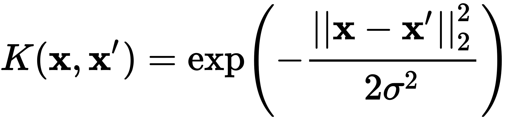

# About Kernel


## [Wikipedia: Kernel Method](https://en.wikipedia.org/wiki/Kernel_method)

```text
In machine learning, kernel methods are a class of algorithms for pattern analysis, whose best known member is the support vector machine (SVM). 
The general task of pattern analysis is to find and study general types of relations (for example clusters, rankings, principal components, correlations, classifications) in datasets. 
For many algorithms that solve these tasks, the data in raw representation have to be explicitly transformed into feature vector representations via a user-specified feature map: in contrast, kernel methods require only a user-specified kernel, i.e., a similarity function over pairs of data points in raw representation.
```
Take care of this one: **a similarity function over pairs of data points in raw representation**.  

Examples:
- RBF(radius basis kernel)  
[](https://en.wikipedia.org/wiki/Radial_basis_function_kernel)  
`\sigma` is a free parameter.  
 **The kernel has an infinite number of dimensions**.

- `l^2` inner product.  
The most well-known metric.  
It's the reason why we have a concept **distance**, and an intuition of `similarity`.

- How do we use `kernel`?  
By using kernels, we reform the `features X targets` spaces and finally make it much more `linear` than using the raw data, 
which makes it easier for models to learn mapping rules(linear one is the best because of its numerical stability and natural overfitting resistance).  
**Do not only care about the models, the datasets is important as well!**.  

In my opinion, the study of kernel is similar to modeling for data in some degree. 


