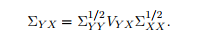
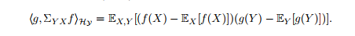
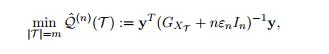

## Feature Selection

Goal: Select a subset of raw features, which performs the best of any other one.

- Why we need this:  

Smaller datasets, faster predicting, more interpretive.   
What's more, fewer parameters help to avoid overfitting.  


- How can we approach:
    * **Wrapper methods** use a predictive model to score feature subsets.
    ```
    example:
        for each subset T in raw features, use T to do a machine learning
        task and then get the validation score as the score of subset T.
    ```    

    * **Filter methods** use a proxy measure instead of the error rate to score a feature subset.
    ```
    examples:
        1. PCA, and other SVD based methods.
        2. pearson correlation.
        3. various entropy, including the variance.
        ...
    ```

    * **Embedded methods** are a catch-all group of techniques which perform feature selection as part of the model construction process.
    ```
    examples:
        1. the frequency of a randomforest's node activation.
        2. each input neuron's contribution to the second layer's variation during the whole training process.
        ...
    ```
    Kernel method is compatible to each of the three above, and
    >  Kernel feature selection methods have the advantage of capturing nonlinear
relationships between the features and the labels. 

We use kernels on conditional covariance operator.

##  Conditional Covariance Minimazation

- Why we use it
> The conditional covariance operator provides a measure of conditional dependence for random
variables.    

Goal: Select a part of features from the raw, and minimize `Q`(univariate case).  
[]()  
where 
- `T` means a subset(with fixed length `m`) of the whole features `[d]`(just as the name suggests, it's a vector with fixed length `d`).
- `Tr` means the trace, while `\Sigma blablah` is a conditional covariance operator.

[]()

[]()

What's []() ?
Here:  
[]().

Both `f` and `g` are linear funtionals, so it's just the definition of covariance!
So here:   
[](), but this one is a covariance operator so that it needs to take some parameters(`X`, `Y`) to evaluate. Remember it as `C_xy`.

> Proposition 2 in [9] further shows that the residual error of g(Y) can be characterized
by the conditional covariance operator. 

[]()


When it comes to a general case, the `Q` becomes  
[]()


------------------

- Reproducing kernel Hilbert spaces
[](https://en.wikipedia.org/wiki/Reproducing_kernel_Hilbert_space)

    `K`: []() is derived from inner product on the Hilbert Space and [Riesz Representation Theorem](https://en.wikipedia.org/wiki/Riesz_representation_theorem).


- Why we minimize `Q`.
    >  We therefore quantify the
    extent of the remaining conditional dependence using some metric Q, and aim to minimize Q over
    all subsets T of the appropriate size


- [Hilbert Schmidt Independence Criterion](http://alex.smola.org/talks/taiwan_5.pdf)


- [Ref \[9\]](https://arxiv.org/pdf/0908.1854.pdf)


## Initial relaxation

relaxing the domain to get the continuous approximate, and then use [project gradient descent](https://math.stackexchange.com/questions/571068/what-is-the-difference-between-projected-gradient-descent-and-ordinary-gradient) to optimize the objective.  
P.S **Removing the inequality constrant** and then use general gradient descent.   